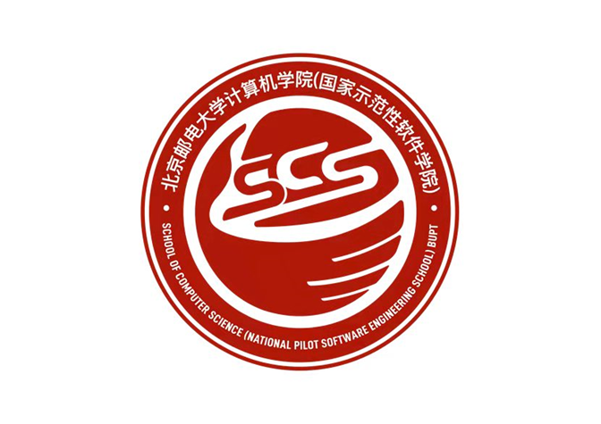
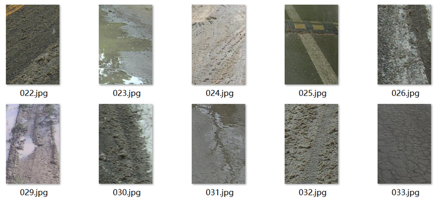
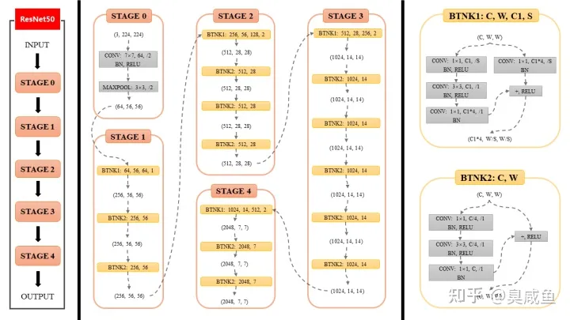

<div align=center>
    <div>
        <b><font size=7>《机器学习》</font></b>
    </div>
    <div>
        <b><font size=7>期末大作业报告</font></b>
    </div>
<font size=6>专业：数据科学与大数据技术</font></div>
<div align=center><font size=6>班级：2020211322</font></div>
<div align=center><font size=6>姓名：王祥龙</font></div>
<div align=center><font size=6>学号：2020211415</font></div>    


# 任务描述

图像场景多分类任务

图片取自不同天气条件下的道路实况，分别为积水、湿和融雪，大小尺寸均为360*240



目标任务：

根据basic_data文件夹中所给的9450张图片，自行将图片分为训练集、验证集和测试集，并根据本课程所学内容，自行设计数据处理方法和构建机器学习模型来解决该分类任务，先在训练集上训练模型，同时，用验证集检验模型性能，在迭代训练多次后，通过测试集来测试模型效果（以准确率作为评价指标），最后，使用训练好的模型去预测pred_data文件中的100张图片，并将预测结果写入pred_data.xls文件，格式如下（写入每张图片预测的label标签）：

# 详细模型设计

模型使用了Resnet50进行训练。代码如下：

```python
import torch.nn as nn
import math


def resnet50(**kwargs):
    """Constructs a ResNet-50 model.
    """
    model = ResNet([3, 4, 6, 3], **kwargs)
    return model


class ResNet(nn.Module):
    """
    block: A sub module
    """

    def __init__(self, layers, num_classes=3, model_path="model.pkl"):
        super(ResNet, self).__init__()
        self.in_channels = 64
        self.modelPath = model_path
        self.conv1 = nn.Conv2d(3, 64, kernel_size=7, stride=2, padding=3,
                               bias=False)
        self.bn1 = nn.BatchNorm2d(64)
        self.relu = nn.ReLU(inplace=True)
        self.maxpool = nn.MaxPool2d(kernel_size=3, stride=2, padding=1)
        self.stack1 = self.make_stack(64, layers[0])
        self.stack2 = self.make_stack(128, layers[1], stride=2)
        self.stack3 = self.make_stack(256, layers[2], stride=2)
        self.stack4 = self.make_stack(512, layers[3], stride=2)
        self.avgpool = nn.AvgPool2d(7, stride=1)
        self.fc = nn.Linear(512 * Bottleneck.expansion, num_classes)
        # initialize parameters
        self.init_param()

    def init_param(self):
        # The following is initialization
        for m in self.modules():
            if isinstance(m, nn.Conv2d):
                n = m.kernel_size[0] * m.kernel_size[1] * m.out_channels
                m.weight.data.normal_(0, math.sqrt(2. / n))
            elif isinstance(m, nn.BatchNorm2d):
                m.weight.data.fill_(1)
                m.bias.data.zero_()
            elif isinstance(m, nn.Linear):
                n = m.weight.shape[0] * m.weight.shape[1]
                m.weight.data.normal_(0, math.sqrt(2. / n))
                m.bias.data.zero_()

    def make_stack(self, planes, blocks, stride=1):
        downsample = None
        layers = []

        if stride != 1 or self.in_channels != planes * Bottleneck.expansion:
            downsample = nn.Sequential(
                nn.Conv2d(self.in_channels, planes * Bottleneck.expansion,
                          kernel_size=1, stride=stride, bias=False),
                nn.BatchNorm2d(planes * Bottleneck.expansion),
            )

        layers.append(Bottleneck(self.in_channels, planes, stride, downsample))
        self.in_channels = planes * Bottleneck.expansion
        for i in range(1, blocks):
            layers.append(Bottleneck(self.in_channels, planes))

        return nn.Sequential(*layers)

    def forward(self, x):
        x = self.conv1(x)
        x = self.bn1(x)
        x = self.relu(x)
        x = self.maxpool(x)

        x = self.stack1(x)
        x = self.stack2(x)
        x = self.stack3(x)
        x = self.stack4(x)

        x = self.avgpool(x)
        x = x.view(x.size(0), -1)
        x = self.fc(x)

        return x


class Bottleneck(nn.Module):
    expansion = 4

    def __init__(self, in_channels, planes, stride=1, downsample=None):
        super(Bottleneck, self).__init__()
        self.conv1 = nn.Conv2d(in_channels, planes, kernel_size=1, bias=False)
        self.bn1 = nn.BatchNorm2d(planes)
        self.conv2 = nn.Conv2d(planes, planes, kernel_size=3, stride=stride, padding=1, bias=False)
        self.bn2 = nn.BatchNorm2d(planes)
        self.conv3 = nn.Conv2d(planes, planes * 4, kernel_size=1, bias=False)
        self.bn3 = nn.BatchNorm2d(planes * 4)
        self.relu = nn.ReLU(inplace=True)
        self.downsample = downsample
        self.stride = stride

    def forward(self, x):
        residual = x

        out = self.conv1(x)
        out = self.bn1(out)
        out = self.relu(out)

        out = self.conv2(out)
        out = self.bn2(out)
        out = self.relu(out)

        out = self.conv3(out)
        out = self.bn3(out)

        if self.downsample is not None:
            residual = self.downsample(x)

        out += residual
        out = self.relu(out)

        return out
```

Resnet作为通用的图像分类网络，主要由5个stages构成。

- stage0由一个卷积层，一个batch normalization，一个relu激活函数和maxpool池化层构成。
- stage1-4为四层重复结构。每个stage由多个bottleneck结构组成。
- bottleneck可分为两种情况。
  - 当输入和输出通道数不同时，对应的是下图中的BTNK1，其将输入的图片向量分成左右两部，左部有三层convolution，右部有一层并加上RELU激活函数，将左部右部结果相加后得到最终输出，其channel数为C1的4倍。
  - 当输入输出通道数相同时，对应的是BNTK2，其区别在于没有了右部的卷积层，直接相加。


# 实验细节

## 实验环境说明

OS:Windows

IDE:教育版pycharm

## 数据处理

首先观察不同类别的图片从肉眼上能否看出明显区别。经观察几类图片肉眼差距很小，所以没有办法根据其特点定制卷积层，使用通用的卷积层。

在处理数据阶段，首先将340\*260的原始图片压缩成224\*224的网络输入标准大小。这里使用了pillow库将其进行缩放，缩放成功的图片保存在`/data/resized`与`/data/test_resized`下。随后，我将训练集每个类文件夹下的所有图片都读入，然后为其附上类标签。读入图片数据时使用了plt的imread函数将其转换成3通道RGB的图片。部分代码如下：

preprocess:

```python
path = 'data/resized'
if not os.path.exists(path):
    os.mkdir(path)
    path1 = 'data/basic_data'
    print('preprocessing data...')
    for root, dirs, files in os.walk(path1):
        for d in dirs:
            if not os.path.exists(os.path.join(path, d)):
                os.mkdir(os.path.join(path, d))
                files1 = os.listdir(os.path.join(path1, d))
                for file1 in tqdm(files1):
                    im = Image.open(os.path.join(path1, d, file1))
                    im = im.resize((224, 224))
                    im.save(os.path.join(path, d, file1))
                    path2 = 'data/test_resized'
                    if not os.path.exists(path2):
                        os.mkdir(path2)
                        test_path = 'data/pred_data'
                        files = os.listdir(test_path)
                        for file in tqdm(files):
                            im = Image.open(os.path.join(test_path, file))
                            im = im.resize((224, 224))
                            im.save(os.path.join(path2, file))
                            print('preprocess success!')
```

import:

```python
path = 'data/resized'
print('importing data...')
for root, dirs, files in os.walk(path):
    for d in dirs:
        files1 = os.listdir(os.path.join(path, d))
        for file1 in tqdm(files1):
            img = plt.imread(os.path.join(path, d, file1))
            img = img.transpose((2, 0, 1))
            images.append(img)
            truth.append(y)
            y += 1
            images = np.array(images)
            truth = np.array(truth)
            print(images.shape)
            print('import data success!')
```

详情可在源码中查看。

## 训练测试过程

将整体数据集按9:1方式分为训练集和验证集。

## 训练过程

初始学习率：

优化器：SGD

scheduler（动态调整学习率的方式）：余弦退火

epochs：10

batch_size：32（因为电脑算力不支持跑太大的batch_size（100就跑不动了），所以只能设为较小的数）

## 评价指标

评价指标为准确率，其值为预测正确的图片数量/测试集的图片数量。这里将全体训练数据作为测试集评价训练效果。

|  lr  | avg acc  |
| :--: | :------: |
| 0.01 | 0.705820 |
| 0.1  | 0.870265 |
| 0.3  | 0.836720 |
| 0.2  | 0.866772 |


# 实验总结

